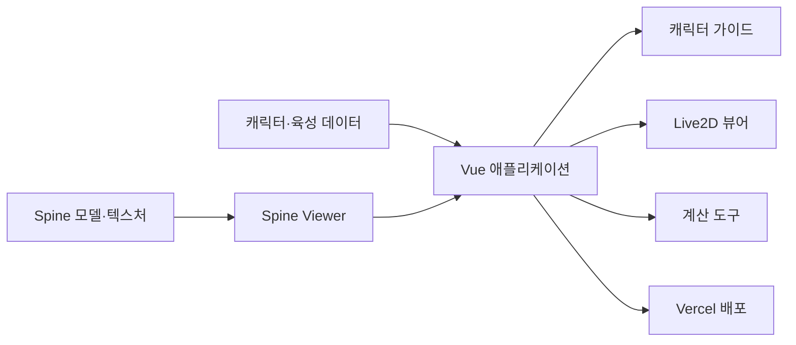

# NIKKE Archive

승리의 여신: 니케의 캐릭터 육성 정보와 Spine 기반 Live2D 뷰어, 각종 계산 기능을 한곳에서 제공하는 비공식 팬 프로젝트입니다.

**배포 사이트:** https://nikkearc.vercel.app

## 주요 기능

### 캐릭터 육성 가이드

- 캐릭터별 스킬 레벨 권장 수치
- 육성 우선순위와 간단한 세팅 정보
- 신규 캐릭터 데이터 지속 업데이트

### Spine Live2D 뷰어

- 브라우저에서 캐릭터 Spine 모델 재생
- 기본·조준·엄폐 등 지원 포즈 선택
- 캐릭터 검색과 필터링
- 모바일과 데스크톱 화면 대응
- 특정 포즈 에셋이 없을 때 기본 포즈로 대체

### 도구 모음

- 전초기지 수익 계산기
- 싱크로 레벨업 비용 계산기
- 게임 플레이에 필요한 보조 계산 기능

## 기술 스택

| 구분 | 기술 |
|---|---|
| Frontend | Vue 3, TypeScript |
| Build | Vite |
| State | Pinia |
| Routing | Vue Router |
| UI | Naive UI, vicons |
| Styling | Less |
| Test | Vitest, Vue Test Utils |
| Deployment | Vercel |

## 서비스 구조



대용량 Spine 모델과 텍스처는 별도 저장소인 [`nikke_l2d-`](https://github.com/yunjae305/nikke_l2d-)에서 관리합니다.

## 로컬 실행

### 요구 환경

- Node.js 18 이상 권장
- npm

### 설치 및 실행

```bash
git clone https://github.com/yunjae305/nikke-archive.git
cd nikke-archive
npm install
npm run dev
```

개발 서버 주소는 터미널에 표시되는 Vite URL에서 확인할 수 있습니다.

## 주요 명령어

| 명령어 | 설명 |
|---|---|
| `npm run dev` | 개발 서버 실행 |
| `npm run build` | 프로덕션 빌드 |
| `npm run preview` | 빌드 결과 미리보기 |
| `npm run type-check` | TypeScript 타입 검사 |
| `npm run test:unit` | 단위 테스트 실행 |
| `npm run lint` | ESLint 검사 및 수정 |
| `npm run format` | Prettier 포맷 적용 |

## 프로젝트 구조

```text
nikke-archive/
├── src/
│   ├── assets/                 # 이미지와 정적 리소스
│   ├── components/             # 공통 UI와 Spine 뷰어 컴포넌트
│   ├── router/                 # Vue Router 설정
│   ├── stores/                 # Pinia 상태 관리
│   ├── utils/                  # 공통 유틸리티와 Spine 관련 코드
│   ├── views/                  # 페이지 단위 화면
│   ├── App.vue
│   └── main.ts
├── scripts/                    # 데이터·리소스 처리 스크립트
├── public/
├── package.json
├── vercel.json                 # SPA 라우팅 설정
└── README.md
```

## 구현 및 개선 내용

- 기존 Vue 기반 뷰어 구조 분석과 한글화
- JSON 데이터 구조를 활용한 캐릭터 검색 및 정보 표시
- Spine 포즈 선택과 에셋 로딩 처리
- 누락된 포즈 요청 시 기본 포즈 fallback 처리
- 모바일 필터·내비게이션·컨트롤 배치 개선
- Vue Router 경로를 새로고침할 때 발생하는 Vercel 404 대응
- Claude Code 등 생성형 AI를 활용한 코드 탐색과 반복 작업 보조

## 데이터 안내

육성 정보는 절대적인 정답이 아니며, 사용자의 보유 캐릭터와 재화 상황에 따라 달라질 수 있습니다. 잘못된 정보나 최신화가 필요한 데이터는 이슈로 알려주시면 확인 후 반영합니다.

## 저장소 관계

| 저장소 | 역할 |
|---|---|
| [`nikke-archive`](https://github.com/yunjae305/nikke-archive) | 웹 애플리케이션, 검색, 가이드, 계산기, 뷰어 UI |
| [`nikke_l2d-`](https://github.com/yunjae305/nikke_l2d-) | Spine 모델, atlas, texture 등 대용량 에셋 관리 |

## 유의사항

- 본 프로젝트는 비공식 팬 프로젝트입니다.
- 게임명, 캐릭터, 이미지와 원본 에셋에 대한 권리는 각 권리자에게 있습니다.
- 저장소의 데이터와 가이드는 참고용이며 상업적 용도를 목적으로 하지 않습니다.
